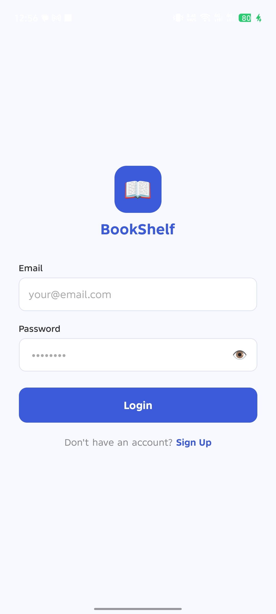
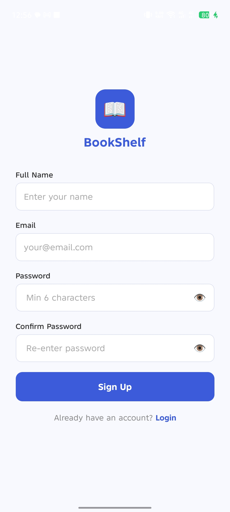
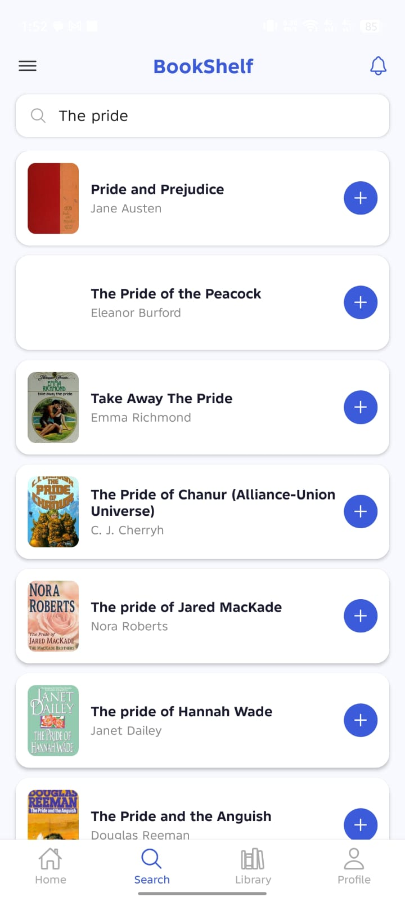
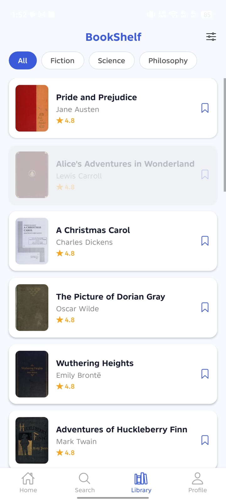
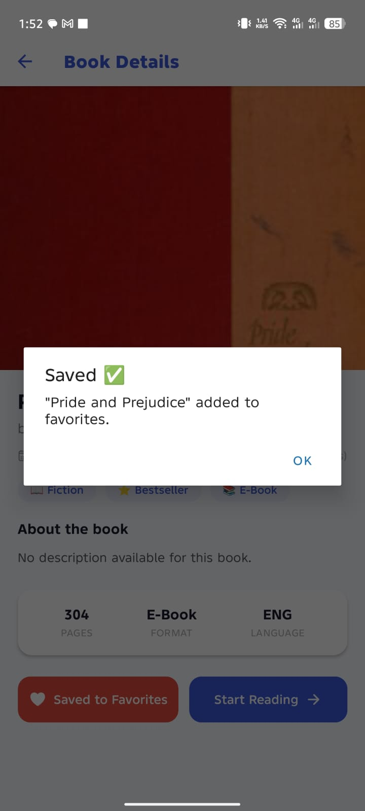
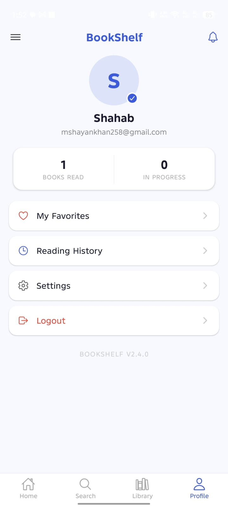

# 📚 BookShelf

**BookShelf** is a modern mobile application built with **React Native (Expo)** that allows users to discover, explore, and manage their personal book collection. Users can register/login using Firebase authentication, browse books via OpenLibrary API, add books to favorites (persisted with AsyncStorage), and manage their reading journey seamlessly.

---

## ✨ Features

| Feature                        | Description                                     |
| ------------------------------ | ----------------------------------------------- |
| 🔐 **Firebase Authentication** | Secure email/password login and registration    |
| 📚 **Book Discovery**          | Browse popular books from OpenLibrary API       |
| ❤️ **Favorites System**        | Save/remove books using AsyncStorage            |
| 🔍 **Real-time Search**        | Instant book search with debouncing             |
| 📖 **Book Details**            | View complete book information                  |
| 👤 **User Profile**            | Manage account and view saved books             |
| 🏷️ **Genre Filtering**         | Filter books by Fiction, Science, History, etc. |
| 🧭 **Expo Router**             | Smooth file-based navigation                    |
| 📱 **Cross-platform**          | Works on iOS, Android, and Web                  |

---

## 🛠️ Tech Stack

| Technology             | Purpose                      |
| ---------------------- | ---------------------------- |
| React Native (Expo 51) | Frontend mobile framework    |
| Expo Router            | File-based navigation system |
| Firebase Auth          | User authentication          |
| Firebase Firestore     | User data storage            |
| AsyncStorage           | Local favorites persistence  |
| OpenLibrary API        | Book data provider           |
| JavaScript (ES6+)      | Programming language         |
| React Hooks            | State management             |

---

## 📁 Project Structure

bookstore/
│
├── app/
│ ├── (auth)/
│ │ ├── login.js # Login screen
│ │ └── register.js # Registration screen
│ │
│ ├── (tabs)/
│ │ ├── \_layout.js # Tab navigation layout
│ │ ├── index.js # Home screen
│ │ ├── search.js # Search screen
│ │ ├── profile.js # User profile screen
│ │ └── booklist.js # All books screen
│ │
│ ├── \_layout.js # Root layout with auth flow
│ └── book-detail.js # Book details screen
│
├── services/
│ ├── bookApi.js # OpenLibrary API calls
│ └── firebaseConfig.js # Firebase configuration
│
├── utils/
│ └── storage.js # AsyncStorage operations
│
├── assets/
│ └── screenshots/ # App screenshots
│ ├── login-screen.jpeg
│ ├── register-screen.jpeg
│ ├── home-screen.jpeg
│ ├── search-screen.jpeg
│ ├── library-screen.jpeg
│ ├── book-detail.jpeg
│ ├── favorites.jpeg
│ └── profile-screen.jpeg
│
├── .gitignore # Git ignore rules
├── app.json # Expo configuration
├── package.json # Dependencies
├── babel.config.js # Babel configuration
└── README.md # Project documentation

## 📱 App Screenshots

### 🔐 Authentication Screens

|                  Login Screen                  |                   Register Screen                    |
| :--------------------------------------------: | :--------------------------------------------------: |
|  |  |

### 🏠 Main Screens

|                 Home Screen                  |                  Search Screen                   |                   Library Screen                   |
| :------------------------------------------: | :----------------------------------------------: | :------------------------------------------------: |
|  |  |  |

### 📖 Book Management

|                     Book Details                     |                    Favorites                    |                   Profile Screen                   |
| :--------------------------------------------------: | :---------------------------------------------: | :------------------------------------------------: |
|  |  |  |

2. Install dependencies

bash
npm install 3. Install additional dependencies

bash
-npx expo install expo-router react-native-safe-area-context -react-native-screens
-npx expo install @react-native-async-storage/async-storage
-npm install firebase
-npx expo install @expo/vector-icons 4. Configure Firebase

Create a project on Firebase Console

Enable Email/Password authentication

Create services/firebaseConfig.js with your Firebase config

5. Start the app

bash
npx expo start
Scan QR code with Expo Go app

Press i for iOS simulator

Press a for Android emulator

📦 Dependencies
json
{
"dependencies": {
"expo": "~51.0.0",
"expo-router": "^3.0.0",
"react": "18.2.0",
"react-native": "0.74.5",
"@react-native-async-storage/async-storage": "1.23.1",
"firebase": "^10.12.0",
"@expo/vector-icons": "^14.0.0"
}
}
🚦 Running Commands
bash

# Start development server

npx expo start

# Clear cache and start

npx expo start -c

# Run on Android

npx expo start --android

# Run on iOS

npx expo start --ios

🐛 Common Issues & Solutions
Issue Solution
Firebase not initializing Check API keys in firebaseConfig.js
AsyncStorage data lost Data clears on app uninstall (expected)
Navigation errors Ensure file names match route names
Build fails Run npx expo start -c to clear cache
🚧 Future Improvements
Add payment gateway integration

Implement push notifications

Add user reviews & ratings

Dark mode support

Offline book access

QR code scanner for ISBN lookup

Reading progress tracker

Social features (share quotes, follow friends)

🤝 Contributing
Fork the repository

Create a feature branch (git checkout -b feature/AmazingFeature)

Commit your changes (git commit -m 'Add some AmazingFeature')

Push to the branch (git push origin feature/AmazingFeature)

Open a Pull Request

📄 License
Distributed under the MIT License. See LICENSE file for more information.

MIT License

Copyright (c) 2024 BookShelf

Permission is hereby granted, free of charge, to any person obtaining a copy
of this software and associated documentation files...
📞 Contact
Developer: Shayan Khan
GitHub: @Shayankhan28
Project Link: https://github.com/Shayankhan28/Bookshelf-App

🙏 Acknowledgments
OpenLibrary API - Book data provider
